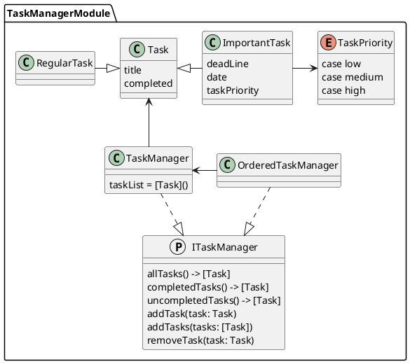

# TaskManagerPackage

This package offers a suite of classes for managing a task list.

Tasks:

	•	Task – A generic task for a to-do list management.
	•	RegularTask – A basic task for to-do list upkeep.
	•	ImportantTask – A prioritized task for to-do list management, emphasizing urgency.

Task Managers:

	•	ITaskManager – A protocol providing management capabilities for a task list.
	•	TaskManager – Manages a task list.
	•	OrderedTaskManager – Manages a task list sorted by priority.

## Package Description

The TaskManager class stores a task list and provides functions for managing it based on the ITaskManager protocol:

	•	func allTasks() -> [Task] – Retrieves the list of all tasks.
	•	func completedTasks() -> [Task] – Retrieves the list of completed tasks.
	•	func uncompletedTasks() -> [Task] – Retrieves the list of uncompleted tasks.
	•	func addTask(task: Task) – Adds a task to the list.
	•	func removeTask(task: Task) – Removes a task from the list.

TaskManager operates with Task instances, each having a completion status (completed) and a title (title).

ImportantTask supports priorities with possible values: low, medium, high.
It also provides a deadline based on its priority. If the priority is set to high, the completion date is set for 
the next day from the creation date, if medium, then for the day after next, and if low, then for three days after 
the current date (using Calendar.current.date).

## UML Diagram

## Installation
### Swift Package Manager
Copy framework url to clipboard:

Copy the framework URL to your clipboard:

Open your project in Xcode and navigate to the “Frameworks, Libraries, and Embedded Content” section in the 
general project settings, then click on the add new library button:

Next, select “Add Other…” -> “Add Package Dependency…”:

In the pop-up window, paste the copied URL into the search bar and press the “Add Package” button:

In the package selection window, ensure the TaskManagerPackage is checked, then press “Add Package”:

## Contributing

Contributions to the MarkdownPackage are welcome. Whether it’s bug reports, feature requests, or contributions 
to code, please feel free to reach out or submit a pull request.

## License

The MarkdownPackage is released under the MIT License. See the LICENSE file for more details.
